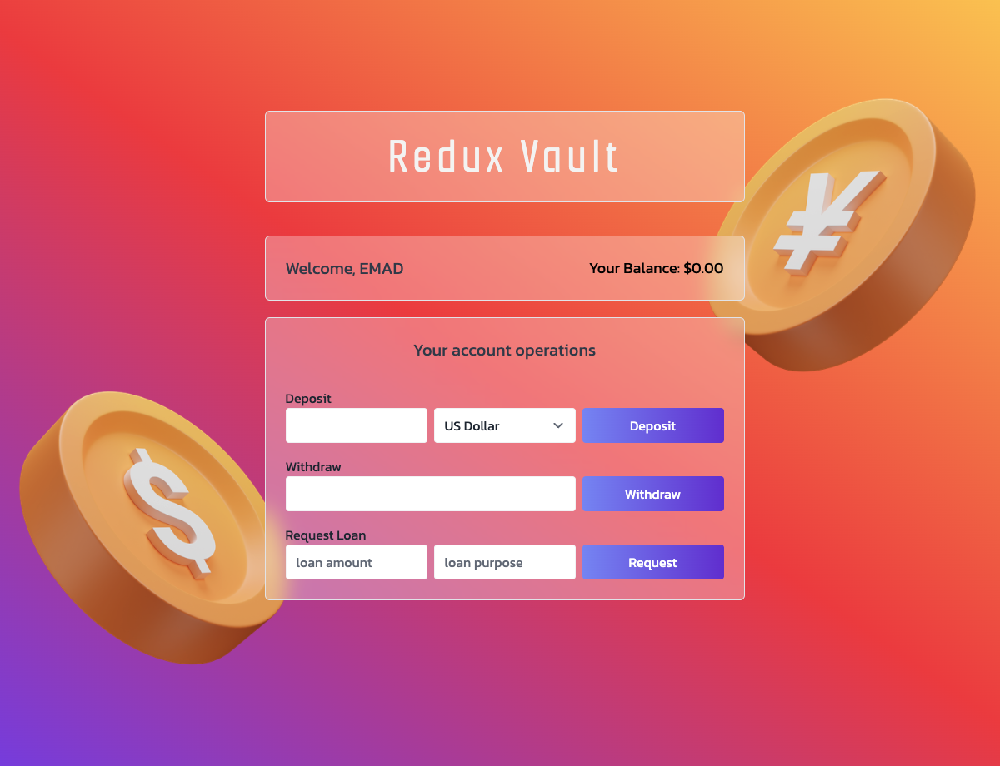

# 💰 ReduxVault

ReduxVault is a modern banking simulation app built with React, TypeScript, Redux Toolkit, and Tailwind CSS. It allows users to deposit, withdraw, and request loans, providing a smooth and interactive experience with real-time state management.

## 🖼️ Screenshots

### 📌 Home Screen

## 🚀 Features

- 💳 **Deposit & Withdraw** – Simulate banking transactions easily.
- 🏦 **Request a Loan** – Borrow money with a specified purpose.
- ✅ **Pay Off Loan** – Settle your loan when you have enough balance.
- ⚡ **Instant State Updates** – Redux Toolkit ensures seamless interactions.
- 🎨 **Attractive UI** – Styled with Tailwind CSS and Glassmorphism design.
- 🔔 **Toasts for Feedback** – Get instant notifications for actions.

## 🛠️ Tools & Technologies

- ⚛️ **React** – Component-based UI development
- 🟦 **TypeScript** – Static typing for better reliability
- 🏗 **Redux Toolkit** – Simplified state management
- 🎨 **Tailwind CSS** – Utility-first styling for a sleek design

## 🔗 Demo

- 🌍 [Try ReduxVault Now!](https://reduxvault-emadabaei.netlify.app)

## 🧪 Testing

- Tests are not implemented yet, but they will be added soon using **Vitest** and **React Testing Library** to ensure reliability and maintainability.

## 📂 Setup & Installation

1️⃣ Clone the repository:
git clone https://github.com/emad-abaei/ReduxVault.git

2️⃣ Navigate to the project directory:
cd ReduxVault

3️⃣ Install dependencies:
npm install

4️⃣ Run the development server:
npm run dev

## 🙌 Acknowledgments

This project was originally inspired by a course by **Jonas Schmedtmann**. The course focused on implementing the logic in **JavaScript** without a UI.

I extended the project by:  
✅ Implementing a full **UI** using **React & Tailwind CSS**  
✅ Migrating the codebase to **TypeScript** for better type safety  
✅ Adding extra features and enhancements

## 📩 Contributing

Contributions are welcome! Feel free to submit issues or pull requests.

## 📜 License

This project is licensed under the MIT License.
